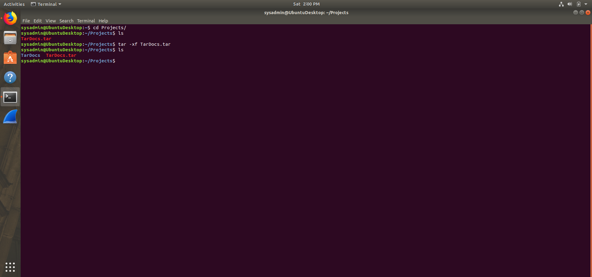
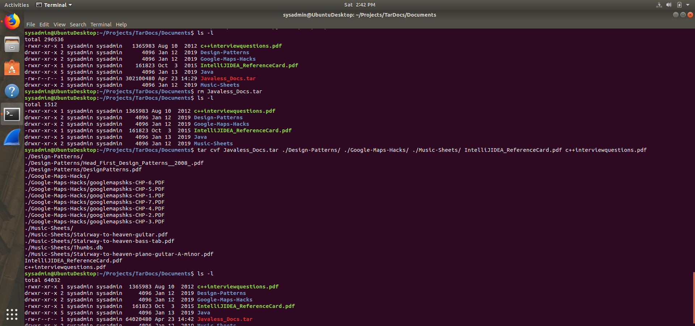
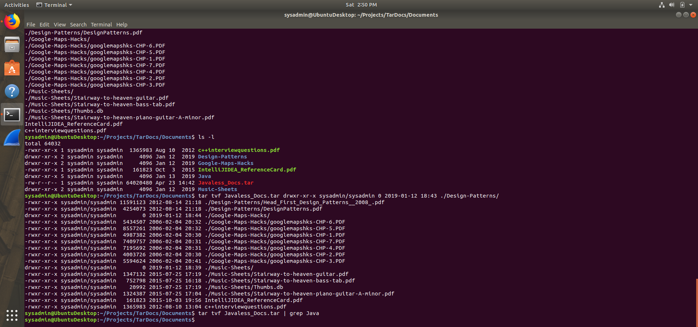
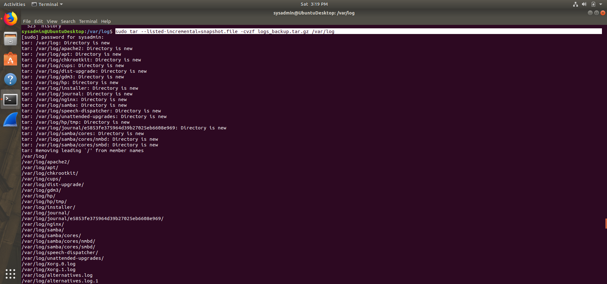
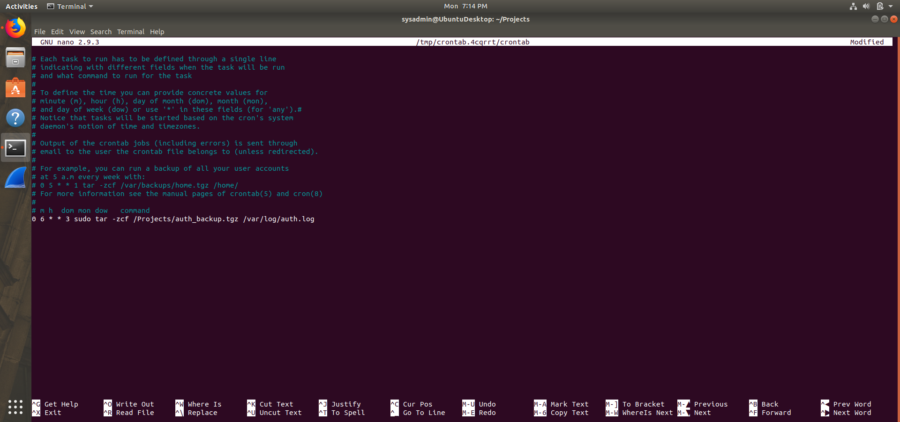
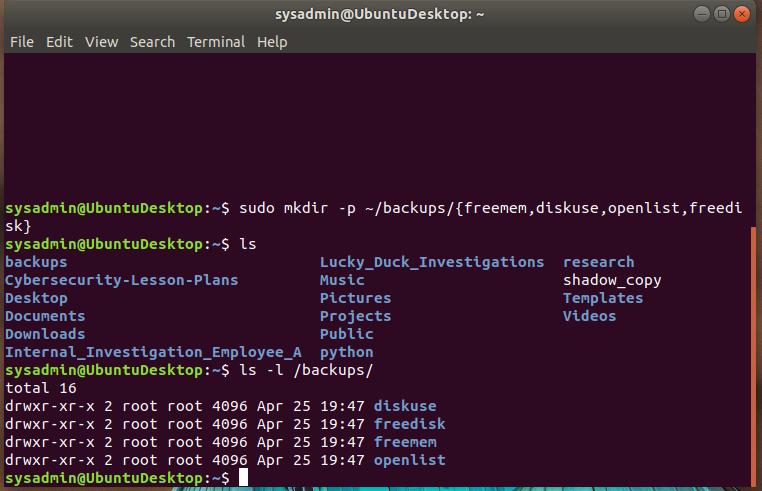
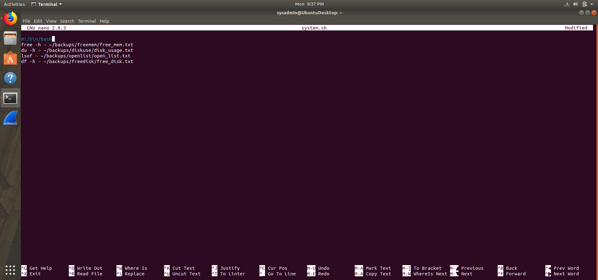
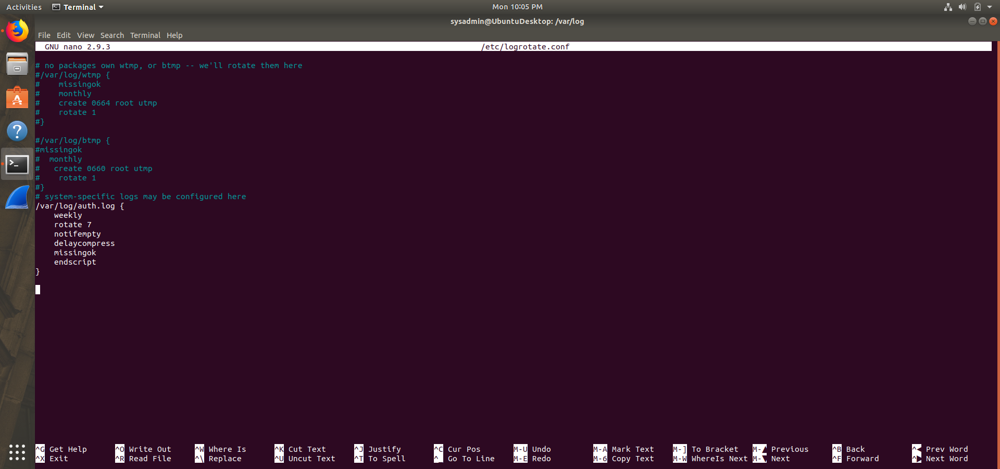
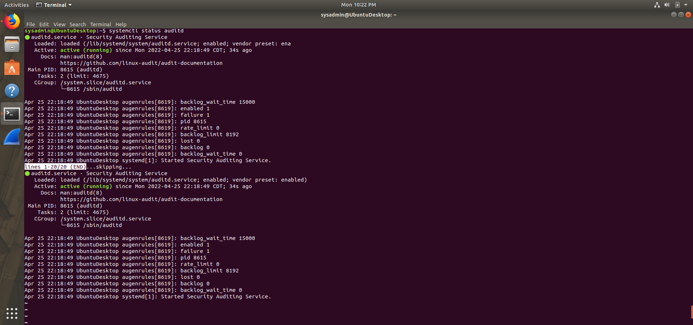
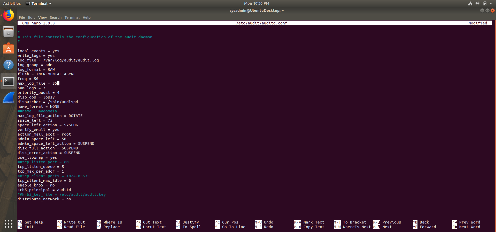

## Musie Belai Week 5 Homework Submission File: Archiving and Logging Data

Please edit this file by adding the solution commands on the line below the prompt.

Save and submit the completed file for your homework submission.

---
### Step 1: Create, Extract, Compress, and Manage tar Backup Archives

1. Command to **extract** the `TarDocs.tar` archive to the current directory:

        tar -xf TarDocs.tar
    

2. Command to **create** the `Javaless_Doc.tar` archive from the `TarDocs/` directory, while excluding the `TarDocs/Documents/Java` directory:

        tar cvf Javaless_Docs.tar ./Design-Patterns/ ./Google-Maps-Hacks/ ./Music-Sheets/ IntelliJIDEA_ReferenceCard.pdf c++interviewquestions.pdf
    

3. Command to ensure `Java/` is not in the new `Javaless_Docs.tar` archive:


        tar tvf Javaless_Docs.tar | grep Java
    


**Bonus** 
- Command to create an incremental archive called `logs_backup.tar.gz` with only changed files to `snapshot.file` for the `/var/log` directory:

        sudo tar --listed-incremental=snapshot.file -cvzf logs_backup.tar.gz /var/log
    


#### Critical Analysis Question

- Why wouldn't you use the options `-x` and `-c` at the same time with `tar`?

        You wouldn't be able to extracted the contents of the tar file if it hadn't been created with -c in a different previous command line as it wouldn't be able to create and extract on the same command line.
---

### Step 2: Create, Manage, and Automate Cron Jobs

1. Cron job for backing up the `/var/log/auth.log` file:

         crontab -e
         0 6 * * 3 sudo tar -zcf /Projects/auth_backup.tgz /var/log/auth.log
         
---

### Step 3: Write Basic Bash Scripts

1. Brace expansion command to create the four subdirectories:

        sudo mkdir -p ~/backups/{freemem,diskuse,openlist,freedisk}


2. Paste your `system.sh` script edits below:

    bash
    
            #!/bin/bash
            free -h > ~/backups/freemem/free_mem.txt
            du -h > ~/backups/diskuse/disk_usage.txt
            lsof > ~/backups/openlist/open_list.txt
            df -h > ~/backups/freedisk/free_disk.txt


3. Command to make the `system.sh` script executable:

        chmod +x system.sh


**Optional**
- Commands to test the script and confirm its execution:

        sudo ./system.sh


**Bonus**
- Command to copy `system` to system-wide cron directory:

        @weekly cp system.sh ~/etc/crontab


### Step 4. Manage Log File Sizes
 
1. Run `sudo nano /etc/logrotate.conf` to edit the `logrotate` configuration file. 

    Configure a log rotation scheme that backs up authentication messages to the `/var/log/auth.log`.

    - Add your config file edits below:

    
    bash
    
            /var/log/auth.log {
                    weekly
                    rotate 7
                    notifempty
                    delaycompress
                    missingok
                    endscript
                    }


---

### Bonus: Check for Policy and File Violations

1. Command to verify `auditd` is active:

        systemctl status auditd


2. Command to set number of retained logs and maximum log file size:

    - Add the edits made to the configuration file below:

    bash
    
                max_log_file = 35
                num_logs = 7



3. Command using `auditd` to set rules for `/etc/shadow`, `/etc/passwd` and `/var/log/auth.log`:


    - Add the edits made to the `rules` file below:

    bash
    
             -w /etc/shadow -p wra -k  hashpass_audit
             -w /etc/passwd -p wra -k userpass_audit
             -w /var/log/auth.log -p wra -k authlog_audit


4. Command to restart `auditd`:

        sudo systemctl restart auditd

5. Command to list all `auditd` rules:

        sudo auditctl -l


6. Command to produce an audit report:

        sudo aureport -au

7. Create a user with `sudo useradd attacker` and produce an audit report that lists account modifications:

        sudo useradd criminal


8. Command to use `auditd` to watch `/var/log/cron`:

9. Command to verify `auditd` rules:

---

### Bonus (Research Activity): Perform Various Log Filtering Techniques

1. Command to return `journalctl` messages with priorities from emergency to error:


1. Command to check the disk usage of the system journal unit since the most recent boot:

1. Comand to remove all archived journal files except the most recent two:


1. Command to filter all log messages with priority levels between zero and two, and save output to `/home/sysadmin/Priority_High.txt`:

1. Command to automate the last command in a daily cronjob. Add the edits made to the crontab file below:

    ```bash
    [Your solution cron edits here]
    ```

---
© 2022 Trilogy Education Services, a 2U, Inc. brand. All Rights Reserved.
